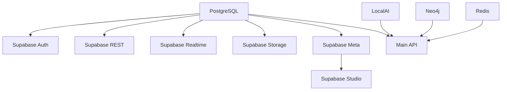

# Political Analysis Database System (v0.5.0)

A comprehensive political analysis platform with knowledge graphs, AI-powered document processing, and self-hosted Supabase integration.

## 🚀 Quick Start

### Prerequisites
- Docker and Docker Compose
- UV package manager (automatically installed if not present)
- 8GB+ RAM recommended
- 10GB+ free disk space

### 1. Clone and Setup
```bash
git clone <repository-url>
cd political-analysis-dbs
cp .env.example .env  # Already done if using this repo
```

### 2. Launch the Complete Stack
```bash
# Build and start all services
docker compose up -d --build

# Monitor logs
docker compose logs -f
```

### 3. Access Services

| Service | URL | Description |
|---------|-----|-------------|
| **Political Analysis API** | http://localhost:8100 | Main REST API and query interface |
| **Supabase Studio** | http://localhost:3001 | Database admin and auth management |
| **Supabase REST API** | http://localhost:3000 | Auto-generated REST API |
| **Neo4j Browser** | http://localhost:7474 | Knowledge graph visualization |
| **LocalAI** | http://localhost:8080 | Local LLM processing |
| **Redis Insight** | http://localhost:8001 | Cache and graph database UI |
| **Adminer** | http://localhost:8082 | Database administration |

### 4. Initialize Data
```bash
# Initialize the database schema
curl -X POST http://localhost:8100/health

# Ingest sample data (requires API keys in .env)
docker compose exec api uv run python civic_legis_unified.py --sync-govinfo --govinfo-collections BILLSTATUS --govinfo-days 5

# Generate embeddings
docker compose exec api uv run python civic_legis_unified.py --embed

# Build politician profiles
docker compose exec api uv run python civic_legis_unified.py --build-profiles
```

## 🏗️ Architecture

### Core Services

- **PostgreSQL + pgvector**: Primary database with vector embeddings
- **Supabase Stack**: Complete self-hosted backend-as-a-service
  - Auth service for user management
  - REST API with auto-generated endpoints
  - Real-time subscriptions
  - Storage service for file management
  - Studio for administration
- **LocalAI**: Local LLM processing (no external API required)
- **Neo4j**: Knowledge graph for relationship analysis
- **Redis Stack**: Caching and optional FalkorDB graph storage

### Data Flow

1. **Ingestion**: Government data (GovInfo, OpenStates, ProPublica)
2. **Processing**: Text extraction, chunking, embedding generation
3. **Storage**: PostgreSQL (structured) + Neo4j (relationships)
4. **Analysis**: LLM-powered summarization and analysis
5. **API**: RESTful endpoints via FastAPI and Supabase

## 📊 Usage Examples

### Query Political Documents
```bash
curl -X POST http://localhost:8100/query \
  -H "Content-Type: application/json" \
  -d '{"query": "healthcare legislation privacy", "k": 5, "plain": true}'
```

### Get Bill Information
```bash
curl -X POST http://localhost:8100/bill \
  -H "Content-Type: application/json" \
  -d '{"bill_id": "HR-1234", "plain": true}'
```

### Politician Analysis
```bash
curl -X POST http://localhost:8100/politician \
  -H "Content-Type: application/json" \
  -d '{"politician_id": "MEMBER_ID"}'
```

### Using Supabase Client
```javascript
import { createClient } from '@supabase/supabase-js'

const supabaseUrl = 'http://localhost:3000'
const supabaseKey = 'your-anon-key-from-env'
const supabase = createClient(supabaseUrl, supabaseKey)

// Query documents
const { data, error } = await supabase
  .from('documents')
  .select('*')
  .limit(10)
```

## 🛠️ Configuration

### Environment Variables
Key settings in `.env`:

```bash
# Database
POSTGRES_PASSWORD=your-secure-password

# API Keys (optional, for data ingestion)
GOVINFO_API_KEY=your-govinfo-key
OPENSTATES_API_KEY=your-openstates-key
PROPUBLICA_API_KEY=your-propublica-key

# AI Processing
EMBED_MODEL=all-MiniLM-L6-v2
OPENAI_API_KEY=optional-for-external-llm

# Neo4j
NEO4J_PASSWORD=your-neo4j-password

# Supabase (pre-configured for development)
JWT_SECRET=your-super-secret-jwt-token-with-at-least-32-characters-long
```

### Scaling Configuration
```bash
# Optional services (uncomment in docker-compose.yml)
docker compose --profile optional up -d

# Development mode with hot reload
docker compose -f docker-compose.yml -f docker-compose.dev.yml up -d
```

## 🔧 Development

### Local Development Setup
```bash
# Install UV package manager
pip install uv

# Install dependencies
uv sync --dev

# Run locally (requires external databases)
uv run python civic_legis_unified.py --serve --port 8100
```

### Running Tests
```bash
# Unit tests
uv run pytest

# Integration tests
uv run python civic_legis_unified.py --run-self-tests

# Code quality
uv run black .
uv run ruff check .
uv run mypy .
```

### Adding New Data Sources
1. Create an ingestor class in `civic_legis_unified.py`
2. Implement the `ingest()` method returning `IngestedDocument` objects
3. Add CLI flags and integrate with the main orchestration loop

## 🐳 Docker Services

### Build Targets
- `development`: Hot reload, dev dependencies
- `production`: Optimized, minimal dependencies

### Service Dependencies
The compose file includes proper health checks and dependency ordering:



### Data Persistence
All data is persisted in Docker volumes:
- `postgres_data`: Database files
- `neo4j_data`: Graph database
- `redis_data`: Cache and session data
- `storage_data`: Supabase file storage
- `localai_data`: AI models and cache

## 🔐 Security

### Authentication
- Supabase Auth handles user registration/login
- JWT tokens for API authentication
- Row Level Security (RLS) policies in PostgreSQL

### Network Security
- Services communicate via internal Docker network
- Only necessary ports exposed to host
- Health checks for service monitoring

### Data Protection
- Encrypted connections between services
- Configurable backup retention
- API rate limiting (configurable)

## 📈 Monitoring & Operations

### Health Checks
```bash
# Service health
docker compose ps

# Application health
curl http://localhost:8100/health

# Database health
curl http://localhost:3000/
```

### Logs
```bash
# All services
docker compose logs -f

# Specific service
docker compose logs -f api

# Follow new logs
docker compose logs -f --tail=100
```

### Backup
```bash
# Database backup
docker compose exec postgres pg_dump -U postgres civic_kg > backup.sql

# Volume backup
docker run --rm -v political-analysis-dbs_postgres_data:/data -v $(pwd):/backup ubuntu tar czf /backup/postgres_backup.tar.gz /data
```

## 🚀 Production Deployment

### Cloud Deployment
1. Update environment variables for production
2. Configure external volumes for persistence
3. Set up reverse proxy (nginx/Traefik)
4. Enable SSL/TLS termination
5. Configure backup strategy

### Performance Tuning
- Adjust PostgreSQL settings for your workload
- Scale LocalAI based on processing needs
- Configure Redis caching strategies
- Optimize embedding batch sizes

## 🤝 Contributing

1. Fork the repository
2. Create a feature branch
3. Make changes with proper tests
4. Ensure code quality (black, ruff, mypy)
5. Submit a pull request

## 📄 License

[Your License Here]

## 🆘 Troubleshooting

### Common Issues

**Services fail to start**
```bash
# Check logs
docker compose logs

# Restart specific service
docker compose restart api
```

**Database connection issues**
```bash
# Verify PostgreSQL is ready
docker compose exec postgres pg_isready -U postgres

# Check connection from API
docker compose exec api uv run python -c "import psycopg2; print('OK')"
```

**Out of memory**
```bash
# Check resource usage
docker stats

# Reduce concurrent processes
docker compose down && docker compose up -d --scale api=1
```

### Getting Help
- Check the logs: `docker compose logs -f`
- Review health endpoints
- Verify environment variables
- Ensure sufficient system resources

## 🔗 Related Projects
- [Supabase](https://supabase.com/)
- [LocalAI](https://localai.io/)
- [Neo4j](https://neo4j.com/)
- [pgvector](https://github.com/pgvector/pgvector)